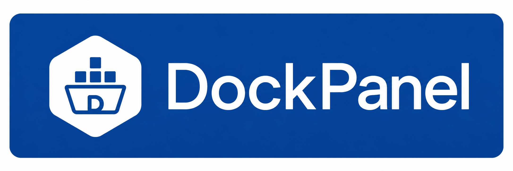

<p align="center">
  
</p>

# DockPanel

> Self-hosted game server management panel. Terinspirasi dari Pterodactyl, dibangun dari nol pakai Laravel.

  

Dikembangkan oleh **Julak Junior** ([@Julakk](https://github.com/Julakk)) — dicoding langsung dari HP via Termux. 🐧📱

---

## Arsitektur

DockPanel punya 2 komponen terpisah, di repo yang berbeda:

```
┌───────────────────┐   HTTP + JWT    ┌──────────────────────┐
│   PANEL (repo ini)  │ ◄─────────────► │   WINGS (daemon Go)   │
│   Laravel 11        │                 │   Docker control      │
│   MySQL/SQLite       │                 │   SFTP + WebSocket     │
└───────────────────┘                 └──────────────────────┘
```

- **Panel** (repo ini): web UI, auth, database user/server/egg, kirim perintah ke node.
- **Wings** ([Julakk/DockWings](https://github.com/Julakk/DockWings)): daemon yang jalan di tiap node/VPS, spawn Docker container per server game.

> **Kompatibilitas:** Panel v0.10.0 butuh **DockWings v0.2.0+** buat nampilin status daemon dan versi di halaman Node.

## Struktur Data Inti

| Tabel              | Fungsi                                                              |
| ------------------ | ------------------------------------------------------------------- |
| `nodes`            | Server fisik/VPS yang jalanin Wings                                 |
| `locations`        | Kategorisasi Node berdasarkan lokasi fisik                          |
| `nests`            | Kategori game (Minecraft, SA-MP, FiveM, dst)                        |
| `eggs`             | Template docker image + startup command per game                    |
| `egg_variables`    | Variabel yang bisa diisi user per egg (ex: `SERVER_JARFILE`)        |
| `servers`          | Instance server game milik user (termasuk masa aktif / expiry)      |
| `server_variables` | Nilai variable egg yang di-set per server                           |
| `allocations`      | Kombinasi IP:port yang di-assign ke server                          |
| `server_subusers`  | Akses terbatas user lain ke satu server, dengan permission granular |
| `server_databases` | Database yang di-provision buat server tertentu                     |
| `database_hosts`   | Host MySQL/MariaDB yang bisa dipakai server                         |
| `mounts`           | Mount point tambahan buat server                                    |
| `activity_logs`    | Histori aktivitas user (login, ganti password, dst)                 |
| `panel_settings`   | Konfigurasi panel (company name, requirement 2FA, dll)              |

## Fitur

**Auth & Keamanan**

- 🔐 Login/logout, proteksi khusus admin (`root_admin` middleware)
- 🔑 Forgot password — flow reset lengkap lewat email
- 📱 Two-Factor Authentication (TOTP, RFC 6238) — kompatibel Google Authenticator/Authy
- 📜 Activity Log — histori login, ganti password/email, enable/disable 2FA

**Admin**

- 🖥️ CRUD Node + Allocation Management (range IP:port, max 100 sekaligus)
- 📡 Halaman detail Node nampilin **status daemon & versi DockWings** (`GET /api/system`, timeout 3 detik)
- 📍 Locations — kategorisasi Node
- 🌐 CRUD Nest + 🥚 CRUD Egg (import JSON kompatibel format Pterodactyl, manage variable)
- 📦 CRUD Server — nyatuin Node + Nest/Egg + Allocation, assign Database Host & Mount, **Provision ke Wings**
- ⏳ **Masa aktif server** — set tanggal expired atau perpanjang X hari; suspend otomatis kalau expired dan kebuka lagi pas diperpanjang
- 👥 CRUD Users + role admin
- 🔧 Settings (company name, 2FA requirement, default language)
- 🔗 Application API (token Sanctum)
- 🗄️ Database Hosts + 📁 Mounts

**Client Area (user biasa)**

- 📋 My Servers — daftar server milik sendiri atau yang di-subuser-kan
- 🎮 **Halaman server ala Pterodactyl** — breadcrumb, pill status, UUID & alamat, tombol power, tile CPU / Memory / Disk, dan tab Console / Files / Settings / Startup (`/client/servers/{server}`)
- ⚡ **Power control** (start / restart / stop / kill) dan kirim command ke console, dengan akses owner, subuser, atau root admin
- 📊 **Resource usage** CPU/Memory/Disk, polling tiap 5 detik lewat `ServerResourceService` (fallback ke mode mock kalau Wings belum aktif)
- 👤 Account Settings, API Credentials personal, Two-Factor, Activity
- 🤝 Subusers — admin bisa kasih akses server ke user lain dengan permission granular

**Otomasi (Scheduler)**

| Command                    | Fungsi                                      |
| -------------------------- | ------------------------------------------- |
| `servers:suspend-expired`  | Auto-suspend server yang sudah expired      |
| `servers:notify-expiring`  | Kirim email pengingat H-3 sebelum expired   |

Pastikan cron scheduler Laravel aktif:

```
* * * * * cd /var/www/dockpanel && php artisan schedule:run >> /dev/null 2>&1
```

**UI/UX**

- 🎨 Sidebar navigasi ala Pterodactyl, collapse jadi hamburger di HP, menu otomatis menyesuaikan role
- 🖌️ Design system pakai CSS custom properties — konsisten di semua halaman
- 🏷️ Versi panel tampil di Overview dan footer (`config('app.version')`)

**Infrastruktur**

- ⚙️ CI otomatis (GitHub Actions) — install dependency, migrate, code style check (Pint), test (PHPUnit)
- 🚀 One-command installer (`install.sh`) — mirip `pterodactyl-installer`, install Panel atau Node/Wings di VPS Ubuntu 24.04

## Alur Pemakaian

1. Login sebagai admin
2. Bikin **Location** (opsional) dan **Node** (VPS/server fisik)
3. Tambah **Allocation** (IP:port) di halaman detail Node
4. Bikin **Nest** (kategori game) dan **Egg** (template startup), atau import Egg dari JSON
5. Bikin **Server** — pilih owner, node, egg, allocation, resource limit
6. Isi **Variable** server, assign **Database** & **Mount** kalau perlu, tambah **Subuser** kalau mau kasih akses ke user lain
7. Klik **Provision ke Wings**
8. Buka halaman server di client area buat kontrol power, console, dan pantau resource

## Setup Development (Termux)

Database default development pakai **SQLite** (nggak perlu nyalain service MySQL manual tiap sesi):

```
cp .env.example .env
touch database/database.sqlite
php artisan key:generate
php artisan migrate --seed
php artisan serve
```

## Install ke VPS Produksi

```
bash <(curl -s https://raw.githubusercontent.com/Julakk/DockPanel/main/install.sh)
```

Menu installer:

| Opsi | Fungsi |
| ---- | ------ |
| 1 | Install Panel: PHP 8.3, MariaDB, Nginx, `.env` mode production (`APP_DEBUG=false`), dan cron scheduler Laravel (`/etc/cron.d/dockpanel`) |
| 2 | Install Node/Wings di VPS Ubuntu 24.04 yang beda: Docker, Go (versinya ngikutin `go.mod` DockWings, amd64 dan arm64), build, dan service systemd. Config lama nggak ditimpa tanpa konfirmasi |
| 3 | Update Panel: `git pull --ff-only`, `composer install`, `migrate`, bersihin cache. Perubahan lokal yang belum di-commit diamankan ke `git stash` |
| 4 | Update Wings: `git pull --ff-only`, build ke file sementara, ganti binary, restart. Kalau service baru gagal start, binary lama dikembalikan otomatis (`/usr/local/bin/dockwings.bak`) |

Urutan update yang aman: Panel dulu (opsi 3), baru Wings di tiap node (opsi 4). Cek `CHANGELOG.md` buat versi Wings minimal yang dibutuhkan tiap rilis.

> Installer belum menyiapkan Database Host (user MySQL buat fitur database), phpMyAdmin SSO, atau akses MariaDB dari jaringan Docker. Itu masih disetup manual setelah install.

## Menghubungkan Panel ke Wings

Saat bikin Node, atur **scheme** sesuai cara Wings melayani koneksi:

| Config Wings          | Scheme Node di Panel |
| --------------------- | -------------------- |
| default (tanpa SSL)   | `http`               |
| `ssl` aktif (v0.2.0+) | `https`              |

Scheme yang nggak cocok bikin error `cURL error 35 ... wrong version number` pas Provision. Panel sekarang nampilin petunjuk jelas (scheme salah, koneksi ditolak, atau timeout) di Provision dan halaman Node.

## Testing

```
php artisan test
```

Test Panel (auth, admin, client area, expiry, TOTP, dll) jalan tanpa Docker. Buat tes end-to-end Panel ↔ Wings, jalanin DockWings di VPS Linux dan arahkan Node ke sana.

## Roadmap

- [x] Skeleton migration + model, `WingsService`
- [x] Auth + role admin/user + 2FA + Forgot Password
- [x] CRUD Node/Nest/Egg/Server + Allocation
- [x] Halaman admin lengkap (Users, Locations, Settings, Application API, Databases, Mounts)
- [x] Assign Database Host & Mount ke Server
- [x] Client Area buat user biasa
- [x] Subusers + Activity Log
- [x] Redesign UI total — sidebar, design token, hover/focus state
- [x] DockWings (Go) + `DockerEnvironment` asli
- [x] One-command installer script (Panel + Wings)
- [x] Halaman server client area ala Pterodactyl (power, console, resource)
- [x] Masa aktif server (auto-suspend + email pengingat)
- [x] Status daemon & versi Wings di halaman Node
- [x] WebSocket console real-time
- [x] File manager (proxy ke SFTP Wings)
- [x] Testing `WingsService` ↔ DockWings end-to-end
- [ ] Billing/expiry integration lanjutan (opsional, buat dipakai di Ahmad Store)

## Kontribusi

Mau bantu development DockPanel? Cek [CONTRIBUTING.md](CONTRIBUTING.md).

## License

MIT
